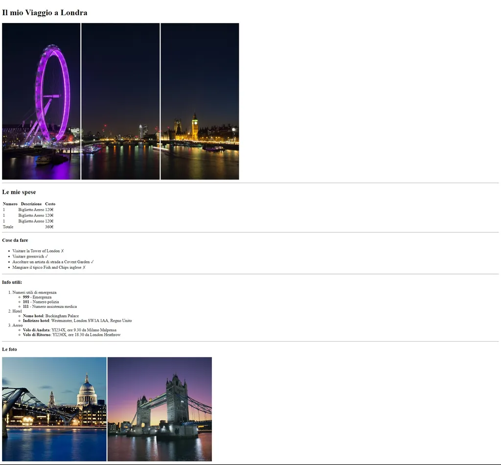

Secondo Esercizio Classe #137 - Boolean
===
Studente: Fabio Ferrero

---
# English

## Target of the project:
Replicate a web page using HTML alone, starting from a screenshot

---
# Italiano

## Obiettivo del progetto:
Replicare una pagina web con il solo utilizzo di HTML, partendo da uno screenshot

---

---

---
<strong>Lo screenshot della pagina fornita dal coach è il seguente:</strong>

